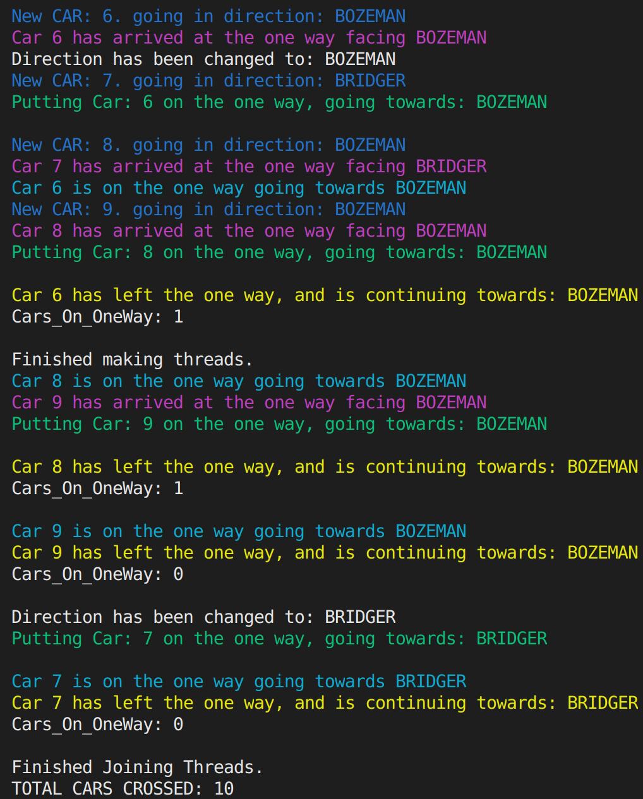

# CSCI-460-Operating-Systems-Assignment-1
## The Bridger Canyon Drive Construction Project
Assignment Due: Wednesday, October 16th, 2019

# Design

## I/O:
For my input arguements, I use the following formating: `./run_me` `number_of_cars` `threshold` `direction_change_limit` `seed`
    
    - `./run_me`: just the executable generated by my make file in src.
    - `number_of_cars`: the amount of cars to be generated for the simulation.
    - `threshold`: the maximum amount of cars the `one way` can handle at a given time.
    - `direction_change_limit`: the maxiumum amount of cars that can go in a row before the direction is changed to allow for cars heading the other direction to go.
    - `seed`: the seed used for randomly generating new car's directions.

Alternatively, the program can be run with just `./run_me` and will be set to the following default values:

    - `number_of_cars`: 100
    - `threshold`: 10
    - `direction_change_limit`: 15
    - `seed`: determined by system time

As for the output, things are color coded with respect to what action is occuring.

    - Blue is for a new Car that has just been generated.
    - Magenta for those that have just arrived at the one way.
    - Green for when a Car is put onto the one way.
    - Cyan for when a car is on the one way.
    - Yellow for when a car successfully exits the one way

It is also worth noting that any print out mentioning a car here includes it's ID and DIRECTION.

Direction Changes, remaining cars on the one way, and direction changes are all in plain white text.

## Synchronization:

Note: the direction_change_limit does not make use of any kind of management thread. (There is no 'bridgemanager' thread, as per the requirements)

There is no bridgemanager thread, or anything of the sort, however to keep from forcing cars to wait until every other car going the opposite direction has gone, I do use a value taken in as an arguement (`direction_change_limit`) to limit the amount of cars going the same direction that can be added to the one way in a row before the direction is changed.

## Safety:

An instance where two cars going the opposite direction enter the one way is prevented by a pthread_cond_timedwait function inside of a while loop that prevents the car from being able to progress to the state of entering the one way until the the current direction of traffic matches that car's direction.

Additionally, when the direction is being changed, a condition is set that won't allow any cars to move onto the one way. This condition stays in effect until there are no more cars on the one way, and is then cleared, allowing traffic flow to resume.

Due to the strict ruling described above, if there where any errors, it would have to come from deprivation of resources (starvation), causing a dead lock by resources not being handled properly. However after extensive testing, I can say with 100% certainty that is not occuring.

As for avoiding one-way collapses, the while loop includes a condition for when the current count of cars on the one way are at the threshold of what we want to allow. Thus it will stay in the while loop and continue calling it's timed wait condition function until all the conditions are matched.

All count variable modification and access are under the protection of a locked mutex, so there is no need to worry about values being duplicated, read before updating, etc.

Clarification: The conditions for the while loop to pass allowing a car to enter the one way are as follows:
 - The amount of cars on the one way must be under it's threshold.
 - The direction the car is going must face the current flow of traffic.
 - The `draining condition` boolean variable must not be set to true; which means to say we are not in the middle of waiting for all the cars on the one way to exit before changing the direction of traffic on the one way.

## Liveness:

Once the cars get on the one way, they show they are present on it, and then leave the one way. There are some mutex locks on the leaving portion for iterating important variables, however those values will always eventually be avalible thanks to the usage of timed wait conditions in other areas of the code. Thus gaurenteeing they make it.

Also, there is a counter that keeps track of the cars that have finished exiting the one way successfully, which reports the amount of cars that crossed after the threads join, which has consistently reported back the apropriate value, ensuring my code works as intended.

If cars are waiting still, and the one way is empty, the direction will be changed to allow those cars to enter the one way. This is done by an if statement in the while loop that dictates each car's ability to enter the one way. This does result however in seemingly unnecessary switching at times, seeing as multiple threads can meet this condition allowing for more direction changes than the ideal. However this is difficult if not impossible to manage syncronioustly while also expecting the flow of traffic to be reasonably fair.

## Efficiency

Multiple cars are allowed on the one way at a time, so long as they are going in the same direction and the one way is under it's maximum capacity.

Once cars leave the one way, more are immidiently able to fill in, provided they are going the same direction.

This will continue to occur until the `direction_change_limit` is met, which will result in the blocking of cars entering the one way until it is empty, followed by the direction of the flow of traffic being reversed. 

This way other cars heading in the opposite direction can be allowed to go for a while without having to wait for every single car from the other side to go across first.

# Testing Methods

## Dead lock testing:

    Consisted of running the code with different seeds and input variable sizes to see if it froze up anywhere.

    If it did freeze, I'd then take a look at the most recent of the color coded print statements to get an idea of simulations status at that point, to infer what caused the dead lock.

    This occured a good bit when I was figuring out the best ordering of my mutex variables, but was consistently simple to track down the cause of.

## Live lock testing: 

    As for livelock testing, the process was more or less the same as what I did for dead lock testing, however rather than just a hang, I'd be looking for endlessly repeating print statements.

    This approach could very much be improved upon, seeing as there was a case where live lock occured where I didn't have any prints occuring, fooling me to beleive it was a deadlock issue for a while.

    The cause being fixed in the project's current iteration, of course.

## Ensuring against Starvation

    - For the method of how I prevent this, see Safety & Liveness sections

    To ensure that we don't have issues of no resource forfeiture, I simply follow the order of the color coded print statements from my results, which make it reasonably simple to see if all the cars heading to Bozeman are going through the one way before the ones heading to Belgrade are.

## Ensuring Values:

    I was sure to keep track of how manny cars had crossed the one way to make sure there weren't any being dropped or left out.

    This value is presented as the total cars crossed at the end of every run.

    To ensure the amount of cars currently on the one way, I printed out the amont currently on the one way preceided by the car's actions, making it easy to trace what had occured, as to infer what should be what when.

## Handling Race Conditions:

    - See the Safety & Liveness sections of the Design portion before continuing.

# Testing Examples

## Sampling sizes used to check for errors:
- 10 cars: Initial size when building up the basic bones of the project to ensure counters functioned as intended, car where generated properly, etc.

- 20 cars: For ltheseight mutex lock testing, in which I mostly wanted to be sure there weren't dead/live locks occuring between changes to the code base

- 100 cars: For ensuring starvation dosen't occur in such a manner that allows cars going in one direction to all go before allowing for any of the cars going the other direction to go.

- 1,000 cars: More of the saem for the few above, just a high level of scrutiny.

- 10,000 cars: Stress testing, and to be absolutely certain there where no livelock/deadlock issues.

## Additional Parameter Choice Range:
I usually used a small threshold for the one way's max car limit, keeping it between 10 to 20.

The amount of cars to allow between direction changes however varied typically between 10 and 100. (refering to the `direction change limit`)

The seed I would change from time to time aswell, though would keep consistent when testing a particular area.

## Examples:

### Smaller Example:
Running the command with the following parameters: `./run_me 20 7 5 404`

which is to say we use 10 cars, setting the one way's max car capacity as 3, our `direction change limit` as 4, and our seed as 404.

OUTPUT:

These screen shots should display the color coding mentioned before, for each action performed on a Car. Though such screen shots would be difficult to capture a larger run as done below.

### Larger Example:
Running the command with the following parameters: `./run_me 100 10 15 404`

which is to say we use 100 cars, setting the one way's max car capacity as 10, our `direction change limit` as 15, and our seed as 404.

yeilds the following print out: (NOTE: Color dosen't carry over)

SIMULATION SETTINGS:
1) Initializing with 100 Cars.
2) Maximum # of cars allowed on the one-way: 10
3) Maximum # of cars per one-way cycle: 15

New CAR: 0. going in direction: BRIDGER
Car 0 has arrived at the one way facing BRIDGER
Putting Car: 0 on the one way, going towards: BRIDGER

Car 0 is on the one way going towards BRIDGER 
New CAR: 1. going in direction: BOZEMAN
Car 1 has arrived at the one way facing BOZEMAN
Car 0 has left the one way, and is continuing towards: BRIDGER
Cars_On_OneWay: 0

Direction has been changed to: BOZEMAN
Putting Car: 1 on the one way, going towards: BOZEMAN

New CAR: 2. going in direction: BRIDGER
Car 2 has arrived at the one way facing BRIDGER
Car 1 is on the one way going towards BOZEMAN 
New CAR: 3. going in direction: BOZEMAN
Car 3 has arrived at the one way facing BOZEMAN
Car 1 has left the one way, and is continuing towards: BOZEMAN
Cars_On_OneWay: 0

Direction has been changed to: BRIDGER
Direction has been changed to: BOZEMAN
New CAR: 4. going in direction: BRIDGER
Direction has been changed to: BRIDGER
Car 4 has arrived at the one way facing BRIDGER
Putting Car: 4 on the one way, going towards: BRIDGER

New CAR: 5. going in direction: BRIDGER
Car 5 has arrived at the one way facing BRIDGER
Car 4 is on the one way going towards BRIDGER 
Car 4 has left the one way, and is continuing towards: BRIDGER
Cars_On_OneWay: 0

New CAR: 6. going in direction: BOZEMAN
Direction has been changed to: BOZEMAN
Direction has been changed to: BRIDGER
Direction has been changed to: BOZEMAN
Direction has been changed to: BRIDGER
Car 6 has arrived at the one way facing BOZEMAN
Putting Car: 5 on the one way, going towards: BRIDGER

Car 5 is on the one way going towards BRIDGER 
Car 5 has left the one way, and is continuing towards: BRIDGER
Cars_On_OneWay: 0

Direction has been changed to: BOZEMAN
Putting Car: 3 on the one way, going towards: BOZEMAN

Car 3 is on the one way going towards BOZEMAN 
Car 3 has left the one way, and is continuing towards: BOZEMAN
Cars_On_OneWay: 0

Direction has been changed to: BRIDGER
Putting Car: 2 on the one way, going towards: BRIDGER

Car 2 is on the one way going towards BRIDGER 
Car 2 has left the one way, and is continuing towards: BRIDGER
Cars_On_OneWay: 0

Direction has been changed to: BOZEMAN
Putting Car: 6 on the one way, going towards: BOZEMAN

Car 6 is on the one way going towards BOZEMAN 
Car 6 has left the one way, and is continuing towards: BOZEMAN
Cars_On_OneWay: 0

New CAR: 7. going in direction: BRIDGER
Car 7 has arrived at the one way facing BRIDGER
New CAR: 8. going in direction: BOZEMAN
Direction has been changed to: BRIDGER
New CAR: 9. going in direction: BOZEMAN
Car 8 has arrived at the one way facing BOZEMAN
Car 9 has arrived at the one way facing BOZEMAN
Direction has been changed to: BOZEMAN
Direction has been changed to: BRIDGER
Direction has been changed to: BOZEMAN
Putting Car: 9 on the one way, going towards: BOZEMAN

Putting Car: 8 on the one way, going towards: BOZEMAN

Car 9 is on the one way going towards BOZEMAN 
Car 8 is on the one way going towards BOZEMAN 
Car 9 has left the one way, and is continuing towards: BOZEMAN
Cars_On_OneWay: 1

Car 8 has left the one way, and is continuing towards: BOZEMAN
Cars_On_OneWay: 0

Direction has been changed to: BRIDGER
Putting Car: 7 on the one way, going towards: BRIDGER

Car 7 is on the one way going towards BRIDGER 
Car 7 has left the one way, and is continuing towards: BRIDGER
Cars_On_OneWay: 0

New CAR: 10. going in direction: BOZEMAN
Car 10 has arrived at the one way facing BOZEMAN
Direction has been changed to: BOZEMAN
New CAR: 11. going in direction: BRIDGER
Putting Car: 10 on the one way, going towards: BOZEMAN

Car 11 has arrived at the one way facing BRIDGER
New CAR: 12. going in direction: BOZEMAN
Car 12 has arrived at the one way facing BOZEMAN
Car 10 is on the one way going towards BOZEMAN 
New CAR: 13. going in direction: BRIDGER
Car 13 has arrived at the one way facing BRIDGER
Car 10 has left the one way, and is continuing towards: BOZEMAN
Cars_On_OneWay: 0

Direction has been changed to: BRIDGER
Putting Car: 11 on the one way, going towards: BRIDGER

Putting Car: 13 on the one way, going towards: BRIDGER

Car 11 is on the one way going towards BRIDGER 
Car 13 is on the one way going towards BRIDGER 
Car 11 has left the one way, and is continuing towards: BRIDGER
Cars_On_OneWay: 1

Car 13 has left the one way, and is continuing towards: BRIDGER
Cars_On_OneWay: 0

Direction has been changed to: BOZEMAN
Putting Car: 12 on the one way, going towards: BOZEMAN

Car 12 is on the one way going towards BOZEMAN 
Car 12 has left the one way, and is continuing towards: BOZEMAN
Cars_On_OneWay: 0

New CAR: 14. going in direction: BRIDGER
Car 14 has arrived at the one way facing BRIDGER
Direction has been changed to: BRIDGER
New CAR: 15. going in direction: BOZEMAN
Putting Car: 14 on the one way, going towards: BRIDGER

Car 15 has arrived at the one way facing BOZEMAN
Car 14 is on the one way going towards BRIDGER 
Car 14 has left the one way, and is continuing towards: BRIDGER
Cars_On_OneWay: 0

Direction has been changed to: BOZEMAN
New CAR: 16. going in direction: BRIDGER
Putting Car: 15 on the one way, going towards: BOZEMAN

Car 16 has arrived at the one way facing BRIDGER
New CAR: 17. going in direction: BRIDGER
Car 17 has arrived at the one way facing BRIDGER
Car 15 is on the one way going towards BOZEMAN 
New CAR: 18. going in direction: BRIDGER
Car 18 has arrived at the one way facing BRIDGER
Car 15 has left the one way, and is continuing towards: BOZEMAN
Cars_On_OneWay: 0

New CAR: 19. going in direction: BOZEMAN
Direction has been changed to: BRIDGER
Putting Car: 18 on the one way, going towards: BRIDGER

New CAR: 20. going in direction: BOZEMAN
Car 19 has arrived at the one way facing BOZEMAN
Putting Car: 16 on the one way, going towards: BRIDGER

Car 18 is on the one way going towards BRIDGER 
Putting Car: 17 on the one way, going towards: BRIDGER

Car 20 has arrived at the one way facing BOZEMAN
Car 16 is on the one way going towards BRIDGER 
Car 18 has left the one way, and is continuing towards: BRIDGER
Cars_On_OneWay: 2

Car 17 is on the one way going towards BRIDGER 
Car 16 has left the one way, and is continuing towards: BRIDGER
New CAR: 21. going in direction: BOZEMAN
Cars_On_OneWay: 1

Car 21 has arrived at the one way facing BOZEMAN
New CAR: 22. going in direction: BRIDGER
Car 17 has left the one way, and is continuing towards: BRIDGER
Cars_On_OneWay: 0

Direction has been changed to: BOZEMAN
New CAR: 23. going in direction: BRIDGER
Putting Car: 21 on the one way, going towards: BOZEMAN

Car 22 has arrived at the one way facing BRIDGER
Putting Car: 19 on the one way, going towards: BOZEMAN

Car 21 is on the one way going towards BOZEMAN 
Putting Car: 20 on the one way, going towards: BOZEMAN

New CAR: 24. going in direction: BOZEMAN
New CAR: 25. going in direction: BOZEMAN
Car 19 is on the one way going towards BOZEMAN 
Car 23 has arrived at the one way facing BRIDGER
Car 20 is on the one way going towards BOZEMAN 
New CAR: 26. going in direction: BOZEMAN
Car 26 has arrived at the one way facing BOZEMAN
Car 24 has arrived at the one way facing BOZEMAN
Car 20 has left the one way, and is continuing towards: BOZEMAN
Cars_On_OneWay: 2

New CAR: 27. going in direction: BOZEMAN
Car 27 has arrived at the one way facing BOZEMAN
Car 21 has left the one way, and is continuing towards: BOZEMAN
Cars_On_OneWay: 1

New CAR: 28. going in direction: BRIDGER
Car 19 has left the one way, and is continuing towards: BOZEMAN
Cars_On_OneWay: 0

New CAR: 29. going in direction: BRIDGER
Car 25 has arrived at the one way facing BOZEMAN
Direction has been changed to: BRIDGER
Direction has been changed to: BOZEMAN
New CAR: 30. going in direction: BOZEMAN
Direction has been changed to: BRIDGER
Car 28 has arrived at the one way facing BRIDGER
Putting Car: 28 on the one way, going towards: BRIDGER

New CAR: 31. going in direction: BRIDGER
Car 31 has arrived at the one way facing BRIDGER
Car 29 has arrived at the one way facing BRIDGER
Car 28 is on the one way going towards BRIDGER 
New CAR: 32. going in direction: BOZEMAN
Car 32 has arrived at the one way facing BOZEMAN
Car 28 has left the one way, and is continuing towards: BRIDGER
Cars_On_OneWay: 0

Direction has been changed to: BOZEMAN
Putting Car: 27 on the one way, going towards: BOZEMAN

Car 30 has arrived at the one way facing BOZEMAN
Car 27 is on the one way going towards BOZEMAN 
Car 27 has left the one way, and is continuing towards: BOZEMAN
Cars_On_OneWay: 0

Direction has been changed to: BRIDGER
Direction has been changed to: BOZEMAN
New CAR: 33. going in direction: BOZEMAN
Direction has been changed to: BRIDGER
Direction has been changed to: BOZEMAN
Putting Car: 26 on the one way, going towards: BOZEMAN

Car 33 has arrived at the one way facing BOZEMAN
Car 26 is on the one way going towards BOZEMAN 
Car 26 has left the one way, and is continuing towards: BOZEMAN
Cars_On_OneWay: 0

Direction has been changed to: BRIDGER
Direction has been changed to: BOZEMAN
Putting Car: 33 on the one way, going towards: BOZEMAN

New CAR: 34. going in direction: BRIDGER
Putting Car: 30 on the one way, going towards: BOZEMAN

New CAR: 35. going in direction: BOZEMAN
Car 35 has arrived at the one way facing BOZEMAN
Car 33 is on the one way going towards BOZEMAN 
New CAR: 36. going in direction: BOZEMAN
Car 34 has arrived at the one way facing BRIDGER
Car 30 is on the one way going towards BOZEMAN 
New CAR: 37. going in direction: BOZEMAN
Car 36 has arrived at the one way facing BOZEMAN
New CAR: 38. going in direction: BRIDGER
Car 38 has arrived at the one way facing BRIDGER
Car 37 has arrived at the one way facing BOZEMAN
Car 30 has left the one way, and is continuing towards: BOZEMAN
Cars_On_OneWay: 1

New CAR: 39. going in direction: BRIDGER
Car 39 has arrived at the one way facing BRIDGER
New CAR: 40. going in direction: BRIDGER
Car 40 has arrived at the one way facing BRIDGER
Car 33 has left the one way, and is continuing towards: BOZEMAN
Cars_On_OneWay: 0

New CAR: 41. going in direction: BOZEMAN
Direction has been changed to: BRIDGER
Direction has been changed to: BOZEMAN
Direction has been changed to: BRIDGER
New CAR: 42. going in direction: BOZEMAN
Putting Car: 23 on the one way, going towards: BRIDGER

New CAR: 43. going in direction: BOZEMAN
Car 43 has arrived at the one way facing BOZEMAN
Car 23 is on the one way going towards BRIDGER 
Car 42 has arrived at the one way facing BOZEMAN
Car 41 has arrived at the one way facing BOZEMAN
New CAR: 44. going in direction: BOZEMAN
Car 44 has arrived at the one way facing BOZEMAN
New CAR: 45. going in direction: BOZEMAN
Car 45 has arrived at the one way facing BOZEMAN
New CAR: 46. going in direction: BOZEMAN
Car 23 has left the one way, and is continuing towards: BRIDGER
Cars_On_OneWay: 0

Direction has been changed to: BOZEMAN
New CAR: 47. going in direction: BRIDGER
Putting Car: 36 on the one way, going towards: BOZEMAN

Putting Car: 32 on the one way, going towards: BOZEMAN

Putting Car: 25 on the one way, going towards: BOZEMAN

New CAR: 48. going in direction: BOZEMAN
Car 48 has arrived at the one way facing BOZEMAN
Car 32 is on the one way going towards BOZEMAN 
Car 36 is on the one way going towards BOZEMAN 
Car 25 is on the one way going towards BOZEMAN 
Car 47 has arrived at the one way facing BRIDGER
Car 32 has left the one way, and is continuing towards: BOZEMAN
Cars_On_OneWay: 2

New CAR: 49. going in direction: BOZEMAN
Car 49 has arrived at the one way facing BOZEMAN
Car 36 has left the one way, and is continuing towards: BOZEMAN
Cars_On_OneWay: 1

Car 25 has left the one way, and is continuing towards: BOZEMAN
Cars_On_OneWay: 0

Direction has been changed to: BRIDGER
Direction has been changed to: BOZEMAN
New CAR: 50. going in direction: BOZEMAN
Putting Car: 48 on the one way, going towards: BOZEMAN

Putting Car: 43 on the one way, going towards: BOZEMAN

Putting Car: 41 on the one way, going towards: BOZEMAN

New CAR: 51. going in direction: BRIDGER
Car 51 has arrived at the one way facing BRIDGER
Car 48 is on the one way going towards BOZEMAN 
New CAR: 52. going in direction: BRIDGER
Car 52 has arrived at the one way facing BRIDGER
Car 41 is on the one way going towards BOZEMAN 
Car 46 has arrived at the one way facing BOZEMAN
New CAR: 53. going in direction: BOZEMAN
Car 53 has arrived at the one way facing BOZEMAN
Car 43 is on the one way going towards BOZEMAN 
Car 48 has left the one way, and is continuing towards: BOZEMAN
Cars_On_OneWay: 2

New CAR: 54. going in direction: BRIDGER
Car 54 has arrived at the one way facing BRIDGER
Car 50 has arrived at the one way facing BOZEMAN
New CAR: 55. going in direction: BOZEMAN
Car 55 has arrived at the one way facing BOZEMAN
Car 43 has left the one way, and is continuing towards: BOZEMAN
Cars_On_OneWay: 1

New CAR: 56. going in direction: BRIDGER
Car 56 has arrived at the one way facing BRIDGER
Car 41 has left the one way, and is continuing towards: BOZEMAN
Cars_On_OneWay: 0

Direction has been changed to: BRIDGER
Putting Car: 56 on the one way, going towards: BRIDGER

Car 56 is on the one way going towards BRIDGER 
New CAR: 57. going in direction: BOZEMAN
New CAR: 58. going in direction: BOZEMAN
New CAR: 59. going in direction: BRIDGER
New CAR: 60. going in direction: BOZEMAN
New CAR: 61. going in direction: BRIDGER
New CAR: 62. going in direction: BOZEMAN
New CAR: 63. going in direction: BRIDGER
New CAR: 64. going in direction: BOZEMAN
New CAR: 65. going in direction: BOZEMAN
New CAR: 66. going in direction: BRIDGER
New CAR: 67. going in direction: BRIDGER
New CAR: 68. going in direction: BRIDGER
New CAR: 69. going in direction: BRIDGER
New CAR: 70. going in direction: BOZEMAN
New CAR: 71. going in direction: BOZEMAN
New CAR: 72. going in direction: BOZEMAN
Car 57 has arrived at the one way facing BOZEMAN
Car 59 has arrived at the one way facing BRIDGER
Car 63 has arrived at the one way facing BRIDGER
Car 67 has arrived at the one way facing BRIDGER
Car 68 has arrived at the one way facing BRIDGER
Car 69 has arrived at the one way facing BRIDGER
Car 70 has arrived at the one way facing BOZEMAN
New CAR: 73. going in direction: BRIDGER
New CAR: 82. going in direction: BRIDGER
New CAR: 74. going in direction: BRIDGER
New CAR: 75. going in direction: BRIDGER
New CAR: 83. going in direction: BOZEMAN
New CAR: 77. going in direction: BOZEMAN
New CAR: 78. going in direction: BRIDGER
New CAR: 79. going in direction: BRIDGER
New CAR: 84. going in direction: BOZEMAN
New CAR: 81. going in direction: BOZEMAN
Car 56 has left the one way, and is continuing towards: BRIDGER
Cars_On_OneWay: 0

New CAR: 80. going in direction: BRIDGER
New CAR: 86. going in direction: BRIDGER
New CAR: 76. going in direction: BOZEMAN
Car 80 has arrived at the one way facing BRIDGER
New CAR: 85. going in direction: BRIDGER
Direction has been changed to: BOZEMAN
Car 58 has arrived at the one way facing BOZEMAN
Putting Car: 58 on the one way, going towards: BOZEMAN

Car 62 has arrived at the one way facing BOZEMAN
Car 60 has arrived at the one way facing BOZEMAN
Car 58 is on the one way going towards BOZEMAN 
Car 64 has arrived at the one way facing BOZEMAN
Car 72 has arrived at the one way facing BOZEMAN
Car 71 has arrived at the one way facing BOZEMAN
Car 58 has left the one way, and is continuing towards: BOZEMAN
Cars_On_OneWay: 0

Direction has been changed to: BRIDGER
Putting Car: 67 on the one way, going towards: BRIDGER

Car 73 has arrived at the one way facing BRIDGER
Putting Car: 73 on the one way, going towards: BRIDGER

Car 74 has arrived at the one way facing BRIDGER
Putting Car: 74 on the one way, going towards: BRIDGER

Car 82 has arrived at the one way facing BRIDGER
Putting Car: 82 on the one way, going towards: BRIDGER

Car 83 has arrived at the one way facing BOZEMAN
Car 77 has arrived at the one way facing BOZEMAN
Car 67 is on the one way going towards BRIDGER 
Car 74 is on the one way going towards BRIDGER 
Car 78 has arrived at the one way facing BRIDGER
Car 73 is on the one way going towards BRIDGER 
Car 84 has arrived at the one way facing BOZEMAN
Car 82 is on the one way going towards BRIDGER 
Car 81 has arrived at the one way facing BOZEMAN
Car 86 has arrived at the one way facing BRIDGER
Car 67 has left the one way, and is continuing towards: BRIDGER
Cars_On_OneWay: 3

Car 85 has arrived at the one way facing BRIDGER
Car 61 has arrived at the one way facing BRIDGER
Car 82 has left the one way, and is continuing towards: BRIDGER
Cars_On_OneWay: 2

Car 66 has arrived at the one way facing BRIDGER
Car 75 has arrived at the one way facing BRIDGER
Car 76 has arrived at the one way facing BOZEMAN
Car 65 has arrived at the one way facing BOZEMAN
Car 74 has left the one way, and is continuing towards: BRIDGER
Cars_On_OneWay: 1

Car 73 has left the one way, and is continuing towards: BRIDGER
Cars_On_OneWay: 0

Direction has been changed to: BOZEMAN
Putting Car: 37 on the one way, going towards: BOZEMAN

Putting Car: 57 on the one way, going towards: BOZEMAN

Car 37 is on the one way going towards BOZEMAN 
Car 57 is on the one way going towards BOZEMAN 
Car 37 has left the one way, and is continuing towards: BOZEMAN
Cars_On_OneWay: 1

Car 79 has arrived at the one way facing BRIDGER
Car 57 has left the one way, and is continuing towards: BOZEMAN
Cars_On_OneWay: 0

Direction has been changed to: BRIDGER
Putting Car: 69 on the one way, going towards: BRIDGER

Car 69 is on the one way going towards BRIDGER 
Car 69 has left the one way, and is continuing towards: BRIDGER
Cars_On_OneWay: 0

Direction has been changed to: BOZEMAN
Putting Car: 64 on the one way, going towards: BOZEMAN

Car 64 is on the one way going towards BOZEMAN 
Car 64 has left the one way, and is continuing towards: BOZEMAN
Cars_On_OneWay: 0

Direction has been changed to: BRIDGER
Putting Car: 78 on the one way, going towards: BRIDGER

Putting Car: 52 on the one way, going towards: BRIDGER

Putting Car: 63 on the one way, going towards: BRIDGER

Putting Car: 22 on the one way, going towards: BRIDGER

New CAR: 87. going in direction: BOZEMAN
Car 52 is on the one way going towards BRIDGER 
Car 63 is on the one way going towards BRIDGER 
Car 87 has arrived at the one way facing BOZEMAN
Car 78 is on the one way going towards BRIDGER 
Car 22 is on the one way going towards BRIDGER 
Car 63 has left the one way, and is continuing towards: BRIDGER
Cars_On_OneWay: 3

Car 52 has left the one way, and is continuing towards: BRIDGER
Cars_On_OneWay: 2

Car 22 has left the one way, and is continuing towards: BRIDGER
Cars_On_OneWay: 1

Car 78 has left the one way, and is continuing towards: BRIDGER
Cars_On_OneWay: 0

New CAR: 88. going in direction: BOZEMAN
Direction has been changed to: BOZEMAN
Putting Car: 76 on the one way, going towards: BOZEMAN

Putting Car: 53 on the one way, going towards: BOZEMAN

New CAR: 89. going in direction: BOZEMAN
Car 89 has arrived at the one way facing BOZEMAN
Car 76 is on the one way going towards BOZEMAN 
Car 53 is on the one way going towards BOZEMAN 
Car 76 has left the one way, and is continuing towards: BOZEMAN
Cars_On_OneWay: 1

Car 53 has left the one way, and is continuing towards: BOZEMAN
Cars_On_OneWay: 0

Direction has been changed to: BRIDGER
Putting Car: 40 on the one way, going towards: BRIDGER

New CAR: 90. going in direction: BRIDGER
Car 90 has arrived at the one way facing BRIDGER
Car 40 is on the one way going towards BRIDGER 
Car 40 has left the one way, and is continuing towards: BRIDGER
Cars_On_OneWay: 0

Direction has been changed to: BOZEMAN
Putting Car: 87 on the one way, going towards: BOZEMAN

New CAR: 91. going in direction: BOZEMAN
New CAR: 92. going in direction: BOZEMAN
Car 87 is on the one way going towards BOZEMAN 
Putting Car: 35 on the one way, going towards: BOZEMAN

Car 87 has left the one way, and is continuing towards: BOZEMAN
Cars_On_OneWay: 1

Car 88 has arrived at the one way facing BOZEMAN
Car 35 is on the one way going towards BOZEMAN 
New CAR: 93. going in direction: BOZEMAN
Car 93 has arrived at the one way facing BOZEMAN
Car 35 has left the one way, and is continuing towards: BOZEMAN
Cars_On_OneWay: 0

Car 91 has arrived at the one way facing BOZEMAN
Direction has been changed to: BRIDGER
Direction has been changed to: BOZEMAN
Putting Car: 44 on the one way, going towards: BOZEMAN

Putting Car: 24 on the one way, going towards: BOZEMAN

New CAR: 94. going in direction: BOZEMAN
Putting Car: 71 on the one way, going towards: BOZEMAN

New CAR: 95. going in direction: BRIDGER
Car 95 has arrived at the one way facing BRIDGER
Putting Car: 50 on the one way, going towards: BOZEMAN

Car 24 is on the one way going towards BOZEMAN 
Car 44 is on the one way going towards BOZEMAN 
Car 71 is on the one way going towards BOZEMAN 
New CAR: 96. going in direction: BRIDGER
Car 96 has arrived at the one way facing BRIDGER
New CAR: 97. going in direction: BOZEMAN
Car 97 has arrived at the one way facing BOZEMAN
Car 71 has left the one way, and is continuing towards: BOZEMAN
Cars_On_OneWay: 3

Car 24 has left the one way, and is continuing towards: BOZEMAN
Cars_On_OneWay: 2

Car 92 has arrived at the one way facing BOZEMAN
New CAR: 98. going in direction: BOZEMAN
Car 98 has arrived at the one way facing BOZEMAN
New CAR: 99. going in direction: BRIDGER
Car 99 has arrived at the one way facing BRIDGER
Finished making threads.
Car 94 has arrived at the one way facing BOZEMAN
Car 44 has left the one way, and is continuing towards: BOZEMAN
Cars_On_OneWay: 1

Car 50 is on the one way going towards BOZEMAN 
Car 50 has left the one way, and is continuing towards: BOZEMAN
Cars_On_OneWay: 0

Direction has been changed to: BRIDGER
Direction has been changed to: BOZEMAN
Direction has been changed to: BRIDGER
Direction has been changed to: BOZEMAN
Putting Car: 77 on the one way, going towards: BOZEMAN

Putting Car: 97 on the one way, going towards: BOZEMAN

Putting Car: 92 on the one way, going towards: BOZEMAN

Putting Car: 98 on the one way, going towards: BOZEMAN

Car 77 is on the one way going towards BOZEMAN 
Car 97 is on the one way going towards BOZEMAN 
Car 77 has left the one way, and is continuing towards: BOZEMAN
Cars_On_OneWay: 3

Car 97 has left the one way, and is continuing towards: BOZEMAN
Cars_On_OneWay: 2

Car 98 is on the one way going towards BOZEMAN 
Car 98 has left the one way, and is continuing towards: BOZEMAN
Cars_On_OneWay: 1

Car 92 is on the one way going towards BOZEMAN 
Car 92 has left the one way, and is continuing towards: BOZEMAN
Cars_On_OneWay: 0

Direction has been changed to: BRIDGER
Direction has been changed to: BOZEMAN
Direction has been changed to: BRIDGER
Direction has been changed to: BOZEMAN
Putting Car: 88 on the one way, going towards: BOZEMAN

Putting Car: 93 on the one way, going towards: BOZEMAN

Car 88 is on the one way going towards BOZEMAN 
Car 93 is on the one way going towards BOZEMAN 
Car 93 has left the one way, and is continuing towards: BOZEMAN
Cars_On_OneWay: 1

Car 88 has left the one way, and is continuing towards: BOZEMAN
Cars_On_OneWay: 0

Direction has been changed to: BRIDGER
Putting Car: 34 on the one way, going towards: BRIDGER

Putting Car: 85 on the one way, going towards: BRIDGER

Putting Car: 96 on the one way, going towards: BRIDGER

Putting Car: 51 on the one way, going towards: BRIDGER

Putting Car: 38 on the one way, going towards: BRIDGER

Car 96 is on the one way going towards BRIDGER 
Car 85 is on the one way going towards BRIDGER 
Car 34 is on the one way going towards BRIDGER 
Car 51 is on the one way going towards BRIDGER 
Car 96 has left the one way, and is continuing towards: BRIDGER
Cars_On_OneWay: 4

Car 38 is on the one way going towards BRIDGER 
Car 51 has left the one way, and is continuing towards: BRIDGER
Cars_On_OneWay: 3

Car 38 has left the one way, and is continuing towards: BRIDGER
Cars_On_OneWay: 2

Car 34 has left the one way, and is continuing towards: BRIDGER
Cars_On_OneWay: 1

Car 85 has left the one way, and is continuing towards: BRIDGER
Cars_On_OneWay: 0

Direction has been changed to: BOZEMAN
Direction has been changed to: BRIDGER
Direction has been changed to: BOZEMAN
Putting Car: 70 on the one way, going towards: BOZEMAN

Putting Car: 94 on the one way, going towards: BOZEMAN

Putting Car: 55 on the one way, going towards: BOZEMAN

Putting Car: 42 on the one way, going towards: BOZEMAN

Car 70 is on the one way going towards BOZEMAN 
Car 94 is on the one way going towards BOZEMAN 
Car 70 has left the one way, and is continuing towards: BOZEMAN
Cars_On_OneWay: 3

Car 55 is on the one way going towards BOZEMAN 
Car 55 has left the one way, and is continuing towards: BOZEMAN
Cars_On_OneWay: 2

Car 94 has left the one way, and is continuing towards: BOZEMAN
Cars_On_OneWay: 1

Car 42 is on the one way going towards BOZEMAN 
Car 42 has left the one way, and is continuing towards: BOZEMAN
Cars_On_OneWay: 0

Direction has been changed to: BRIDGER
Direction has been changed to: BOZEMAN
Direction has been changed to: BRIDGER
Direction has been changed to: BOZEMAN
Putting Car: 60 on the one way, going towards: BOZEMAN

Car 60 is on the one way going towards BOZEMAN 
Car 60 has left the one way, and is continuing towards: BOZEMAN
Cars_On_OneWay: 0

Direction has been changed to: BRIDGER
Direction has been changed to: BOZEMAN
Direction has been changed to: BRIDGER
Direction has been changed to: BOZEMAN
Putting Car: 62 on the one way, going towards: BOZEMAN

Putting Car: 83 on the one way, going towards: BOZEMAN

Putting Car: 72 on the one way, going towards: BOZEMAN

Car 62 is on the one way going towards BOZEMAN 
Car 72 is on the one way going towards BOZEMAN 
Car 62 has left the one way, and is continuing towards: BOZEMAN
Cars_On_OneWay: 2

Car 83 is on the one way going towards BOZEMAN 
Car 83 has left the one way, and is continuing towards: BOZEMAN
Cars_On_OneWay: 1

Car 72 has left the one way, and is continuing towards: BOZEMAN
Cars_On_OneWay: 0

Direction has been changed to: BRIDGER
Putting Car: 95 on the one way, going towards: BRIDGER

Putting Car: 80 on the one way, going towards: BRIDGER

Putting Car: 79 on the one way, going towards: BRIDGER

Car 95 is on the one way going towards BRIDGER 
Car 79 is on the one way going towards BRIDGER 
Car 80 is on the one way going towards BRIDGER 
Car 95 has left the one way, and is continuing towards: BRIDGER
Cars_On_OneWay: 2

Car 80 has left the one way, and is continuing towards: BRIDGER
Cars_On_OneWay: 1

Car 79 has left the one way, and is continuing towards: BRIDGER
Cars_On_OneWay: 0

Direction has been changed to: BOZEMAN
Direction has been changed to: BRIDGER
Direction has been changed to: BOZEMAN
Putting Car: 81 on the one way, going towards: BOZEMAN

Car 81 is on the one way going towards BOZEMAN 
Car 81 has left the one way, and is continuing towards: BOZEMAN
Cars_On_OneWay: 0

Direction has been changed to: BRIDGER
Direction has been changed to: BOZEMAN
Putting Car: 91 on the one way, going towards: BOZEMAN

Putting Car: 49 on the one way, going towards: BOZEMAN

Car 91 is on the one way going towards BOZEMAN 
Car 49 is on the one way going towards BOZEMAN 
Car 49 has left the one way, and is continuing towards: BOZEMAN
Cars_On_OneWay: 1

Car 91 has left the one way, and is continuing towards: BOZEMAN
Cars_On_OneWay: 0

Direction has been changed to: BRIDGER
Putting Car: 99 on the one way, going towards: BRIDGER

Putting Car: 75 on the one way, going towards: BRIDGER

Car 75 is on the one way going towards BRIDGER 
Car 99 is on the one way going towards BRIDGER 
Car 75 has left the one way, and is continuing towards: BRIDGER
Cars_On_OneWay: 1

Car 99 has left the one way, and is continuing towards: BRIDGER
Cars_On_OneWay: 0

Direction has been changed to: BOZEMAN
Direction has been changed to: BRIDGER
Putting Car: 54 on the one way, going towards: BRIDGER

Putting Car: 31 on the one way, going towards: BRIDGER

Car 54 is on the one way going towards BRIDGER 
Car 31 is on the one way going towards BRIDGER 
Car 31 has left the one way, and is continuing towards: BRIDGER
Cars_On_OneWay: 1

Car 54 has left the one way, and is continuing towards: BRIDGER
Cars_On_OneWay: 0

Direction has been changed to: BOZEMAN
Direction has been changed to: BRIDGER
Putting Car: 86 on the one way, going towards: BRIDGER

Putting Car: 61 on the one way, going towards: BRIDGER

Car 86 is on the one way going towards BRIDGER 
Car 86 has left the one way, and is continuing towards: BRIDGER
Cars_On_OneWay: 1

Car 61 is on the one way going towards BRIDGER 
Car 61 has left the one way, and is continuing towards: BRIDGER
Cars_On_OneWay: 0

Direction has been changed to: BOZEMAN
Putting Car: 84 on the one way, going towards: BOZEMAN

Car 84 is on the one way going towards BOZEMAN 
Car 84 has left the one way, and is continuing towards: BOZEMAN
Cars_On_OneWay: 0

Direction has been changed to: BRIDGER
Direction has been changed to: BOZEMAN
Direction has been changed to: BRIDGER
Direction has been changed to: BOZEMAN
Direction has been changed to: BRIDGER
Direction has been changed to: BOZEMAN
Direction has been changed to: BRIDGER
Direction has been changed to: BOZEMAN
Direction has been changed to: BRIDGER
Putting Car: 29 on the one way, going towards: BRIDGER

Putting Car: 39 on the one way, going towards: BRIDGER

Car 29 is on the one way going towards BRIDGER 
Car 39 is on the one way going towards BRIDGER 
Car 29 has left the one way, and is continuing towards: BRIDGER
Cars_On_OneWay: 1

Car 39 has left the one way, and is continuing towards: BRIDGER
Cars_On_OneWay: 0

Direction has been changed to: BOZEMAN
Direction has been changed to: BRIDGER
Putting Car: 47 on the one way, going towards: BRIDGER

Putting Car: 66 on the one way, going towards: BRIDGER

Putting Car: 90 on the one way, going towards: BRIDGER

Car 47 is on the one way going towards BRIDGER 
Car 66 is on the one way going towards BRIDGER 
Car 47 has left the one way, and is continuing towards: BRIDGER
Cars_On_OneWay: 2

Car 90 is on the one way going towards BRIDGER 
Car 66 has left the one way, and is continuing towards: BRIDGER
Cars_On_OneWay: 1

Car 90 has left the one way, and is continuing towards: BRIDGER
Cars_On_OneWay: 0

Direction has been changed to: BOZEMAN
Putting Car: 89 on the one way, going towards: BOZEMAN

Car 89 is on the one way going towards BOZEMAN 
Car 89 has left the one way, and is continuing towards: BOZEMAN
Cars_On_OneWay: 0

Direction has been changed to: BRIDGER
Putting Car: 68 on the one way, going towards: BRIDGER

Putting Car: 59 on the one way, going towards: BRIDGER

Car 68 is on the one way going towards BRIDGER 
Car 59 is on the one way going towards BRIDGER 
Car 68 has left the one way, and is continuing towards: BRIDGER
Cars_On_OneWay: 1

Car 59 has left the one way, and is continuing towards: BRIDGER
Cars_On_OneWay: 0

Direction has been changed to: BOZEMAN
Putting Car: 46 on the one way, going towards: BOZEMAN

Putting Car: 45 on the one way, going towards: BOZEMAN

Putting Car: 65 on the one way, going towards: BOZEMAN

Car 46 is on the one way going towards BOZEMAN 
Car 45 is on the one way going towards BOZEMAN 
Car 65 is on the one way going towards BOZEMAN 
Car 46 has left the one way, and is continuing towards: BOZEMAN
Cars_On_OneWay: 2

Car 45 has left the one way, and is continuing towards: BOZEMAN
Cars_On_OneWay: 1

Car 65 has left the one way, and is continuing towards: BOZEMAN
Cars_On_OneWay: 0

Finished Joining Threads.
TOTAL CARS CROSSED: 100